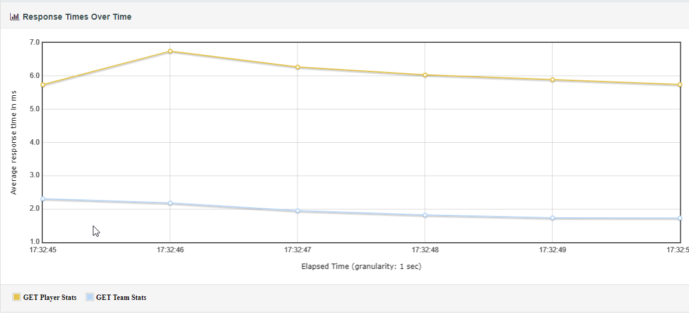
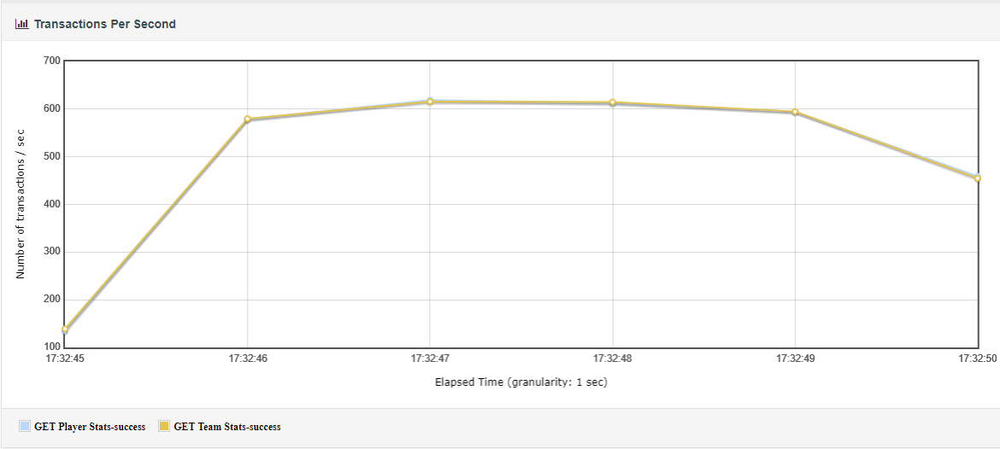
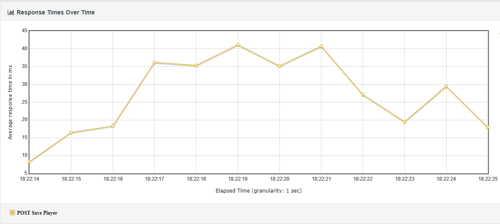
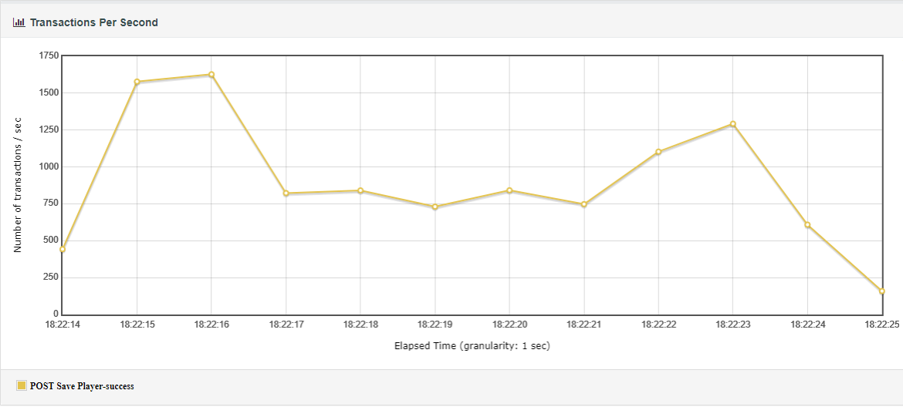
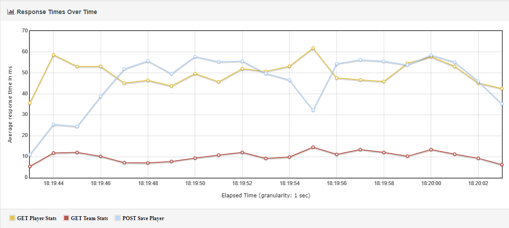
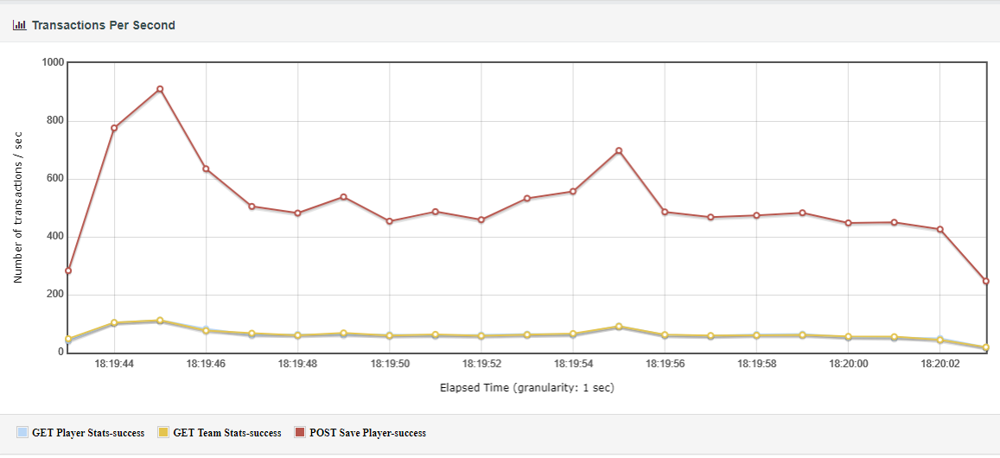

# NBA Player Statistics System

_analysis, implementation details, performance testing_

# Overview

The project implements a scalable system for logging and retrieving NBA player statistics.
It uses Java with the Micronaut framework for its backend and relies on various technologies for performance and
scalability enhancements, including Hazelcast for in-memory data storage and PostgreSQL for persistent storage. The
application is containerized using Docker Compose. Database size influences only the startup time. All statistics data
is kept in memory, which is performance-effective. This approach is feasible because there are no more than 10,000
players, 500 teams, and 100 seasons for the entire NBA history.

The system provides the following capabilities:

- Log NBA player statistics.
- Calculate aggregate statistics **on the fly** per player and per team for a season in **O(1)** complexity.
- **Average Response Time < 50 ms with Throughput ~1k TPS** (3 small replicas on dev PC, will be even better on a real
  production environment).
- Database size influences only the startup time and slightly on memory consumption. All statistics data is held in
  memory (nowadays it's cheap, e.g., 1GB for $5 per month on the cloud, we need at most 2Gb).

# Features

- **Reactive Programming**: Leveraging Micronaut and R2DBC for non-blocking I/O operations.
- **Scalability**: Designed to handle large volumes of requests and data efficiently.
- **High Availability**: Multiple replicas and distributed caching with Hazelcast ensure minimal downtime.
- **Consistency**: Ensures data consistency across different components using Hazelcast map-store, which provides
  eventual consistency.
- **Maintainability**: Modular architecture with clear boundaries and manageable complexity.

# Technologies Used

Java, Micronaut, PostgreSQL, Hazelcast, Docker, NGINX, Gradle, Liquibase, JUnit, Reactive Programming

# Nonfunctional Requirements

- **Scalability**: The system must handle increasing amounts of load, including the ability to scale horizontally.
- **Availability**: The system should ensure high availability, minimizing downtime and ensuring continuous operation.
- **Performance**: The system must have high throughput for both read and write operations.
- **Maintainability**: The system should be easy to maintain and extend, with clear modular boundaries and manageable
  complexity.
- **Consistency**: The system should ensure data consistency across different components and services using Hazelcast
  map-store, which provides eventual consistency.

# Technology/Architecture Decisions

| Comparison                                                             | Pros                                                                                                                                          | Cons                                                                                                                | Decision                                                                                                                                                                         |
|------------------------------------------------------------------------|-----------------------------------------------------------------------------------------------------------------------------------------------|---------------------------------------------------------------------------------------------------------------------|----------------------------------------------------------------------------------------------------------------------------------------------------------------------------------|
| **Java vs. Go**                                                        | **Java:** Rich ecosystem, extensive library support, JVM optimizations.                                                                       | **Java:** Higher memory footprint, longer startup time, slower compared to some alternatives.                       | **Java** was chosen for its robust ecosystem, mature tools, and strong community support.                                                                                        |
|                                                                        | **Go:** Excellent concurrency support, lower memory usage, fast startup.                                                                      | **Go:** Smaller ecosystem, less mature libraries, less suited for complex enterprise applications.                  |                                                                                                                                                                                  |
| **Reactive Style vs. Synchronous, Asynchronous, and Actor Model**      | **Reactive:** Non-blocking I/O, better resource utilization, ideal for many concurrent requests.                                              | **Reactive:** Steeper learning curve, complex error handling, requires reactive ecosystem.                          | **Reactive Style** was chosen for its non-blocking I/O, better resource utilization, and scalability.                                                                            |
|                                                                        | **Synchronous:** Easier to understand, simpler error handling, straightforward coding.                                                        | **Synchronous:** Blocking I/O, resource inefficiencies, not suitable for high concurrency.                          |                                                                                                                                                                                  |
|                                                                        | **Asynchronous:** Non-blocking, better resource utilization, easier transition from synchronous.                                              | **Asynchronous:** Callback hell, complex error handling, requires async libraries.                                  |                                                                                                                                                                                  |
|                                                                        | **Actor Model:** Natural concurrency, simplifies state management, scalable.                                                                  | **Actor Model:** New paradigm, limited support, message-passing overhead.                                           |                                                                                                                                                                                  |
| **Eventual Consistency vs. Strong Consistency vs. Causal Consistency** | **Eventual:** High availability, suitable for distributed systems, better performance.                                                        | **Eventual:** Temporary data staleness, complex to ensure data correctness, increased application logic complexity. | **Eventual Consistency** was chosen for high availability and better performance, despite complexity.                                                                            |
|                                                                        | **Strong:** All nodes see the same data, simplifies application logic, immediate feedback on writes.                                          | **Strong:** Reduced availability, higher latency, complex and costly to maintain.                                   |                                                                                                                                                                                  |
|                                                                        | **Causal:** Causally related operations seen in order, balances between strong and eventual consistency, good for collaborative applications. | **Causal:** More complex than eventual consistency, higher latencies, less intuitive for some use cases.            |                                                                                                                                                                                  |
| **Micronaut vs. Spring vs. Quarkus**                                   | **Micronaut:** Fast startup, low memory footprint, native reactive programming support.                                                       | **Micronaut:** Smaller community, fewer out-of-the-box features compared to Spring.                                 | **Micronaut** was chosen for its lightweight nature, fast startup times, and low memory consumption.                                                                             |
|                                                                        | **Spring Boot:** Extensive feature set, large community, rich ecosystem.                                                                      | **Spring Boot:** Higher memory consumption, slower startup time.                                                    |                                                                                                                                                                                  |
|                                                                        | **Quarkus:** Optimized for containers, fast startup, low memory footprint.                                                                    | **Quarkus:** Less mature, smaller ecosystem, fewer features compared to Spring.                                     |                                                                                                                                                                                  |
| **PostgreSQL vs. MySQL**                                               | **PostgreSQL:** Advanced features, strong consistency, robust for complex queries.                                                            | **PostgreSQL:** Higher setup complexity, resource-intensive.                                                        | **PostgreSQL** is chosen over MySQL due to its advanced features, extensibility, standards compliance, and strong community support.                                             |
|                                                                        | **MySQL:** High performance for read-heavy workloads, large community.                                                                        | **MySQL:** Less suited for complex queries, fewer advanced features.                                                |                                                                                                                                                                                  |
| **Hazelcast vs. Redis vs. Ehcache**                                    | **Hazelcast:** Distributed caching, in-memory data grid, ease of integration.                                                                 | **Hazelcast:** Higher resource usage, more complex configuration.                                                   | **Hazelcast** is chosen over Redis and Ehcache due to its good consistency guarantees, robust distributed caching capabilities, and seamless integration with Java applications. |
|                                                                        | **Redis:** High performance, rich data structures, simplicity.                                                                                | **Redis:** Limited clustering in open-source version, data persistence can be complex.                              |                                                                                                                                                                                  |
|                                                                        | **Ehcache:** Strong integration with Java, local caching, simple setup.                                                                       | **Ehcache:** Not suited for distributed scenarios, limited scalability.                                             |                                                                                                                                                                                  |
| **ZGC vs. G1 GC vs. Shenandoah GC vs. CMS GC**                         | **ZGC:** Low-latency with pause times under 10ms, efficient for large heaps, predictable performance.                                         | **ZGC:** Relatively new, fewer optimizations, higher memory overhead.                                               | **ZGC** was chosen for its low-latency garbage collection and efficiency with large heaps, aligning with the project's needs for high throughput and active memory management.   |
|                                                                        | **G1 GC:** Good performance, low pause times, tunable for optimization.                                                                       | **G1 GC:** Higher pause times than ZGC, complex tuning, higher fragmentation over time.                             |                                                                                                                                                                                  |
|                                                                        | **Shenandoah GC:** Low pause times, concurrent compacting, suitable for large heaps.                                                          | **Shenandoah GC:** Newer and less mature, limited documentation, potentially higher CPU overhead.                   |                                                                                                                                                                                  |
|                                                                        | **CMS GC:** Long history, lower pause times, good for smaller heaps.                                                                          | **CMS GC:** Deprecated post JDK 9, fragmentation issues, less efficient for large heaps.                            |                                                                                                                                                                                  |
| **JSON vs. Protobuf vs. Avro vs. XML**                                 | **JSON:** Human-readable, easy to use, widely supported.                                                                                      | **JSON:** Higher overhead, less efficient serialization.                                                            | **JSON** was chosen for its simplicity, human-readability, and ease of integration despite its higher overhead.                                                                  |
|                                                                        | **Protobuf:** Efficient, compact, supports versioning.                                                                                        | **Protobuf:** More complex, requires schema definition.                                                             |                                                                                                                                                                                  |
|                                                                        | **Avro:** Compact, supports dynamic schemas, good for big data.                                                                               | **Avro:** Requires schema definition, less human-readable.                                                          |                                                                                                                                                                                  |
|                                                                        | **XML:** Highly flexible, supports complex data structures, widely supported.                                                                 | **XML:** Verbose, higher overhead, slower processing.                                                               |                                                                                                                                                                                  |

# API Overview

1. **POST /save**: Save player game data.
    - **Request Body**:
      ```json
      {
        "playerName": "LeBron James",
        "teamName": "Team1",
        "seasonName": "2023-2024",
        "gameId": "2983ec0f-00de-4f64-bdd0-f0b224576da0",
        "points": 25,
        "rebounds": 10,
        "assists": 5,
        "steals": 3,
        "blocks": 2,
        "fouls": 1,
        "turnovers": 4,
        "minutesPlayed": 30.5
      }
      ```
    - **Response**:
        - `200 OK` on success (no body)
        - `400 Bad Request` on validation error
          ```json
          { "error": "Fouls must be between 0 and 6" }
          ```

2. **GET /stats/players**: Get player statistics for a given season (JSON Lines).
    - **Query Parameters**: `season`
    - **Response**: Stream of player statistics in JSON format.
      ```http request
      GET /stats/players?season=2023-2024 HTTP/1.1
      
      HTTP/1.1 200 OK
      Server: nginx
      Content-Type: application/x-json-stream
      Transfer-Encoding: chunked
      
      {"playerName":"LeBron James","avgPoints":7.0,"avgRebounds":20.0,"avgAssists":9.0,"avgSteals":5.0,"avgBlocks":9.0,"avgFouls":2.0,"avgTurnovers":4.0,"avgMinutesPlayed":0.0}
      {"playerName":"Giannis Antetokounmpo","avgPoints":22.0,"avgRebounds":17.0,"avgAssists":1.0,"avgSteals":3.0,"avgBlocks":5.0,"avgFouls":1.0,"avgTurnovers":3.0,"avgMinutesPlayed":0.0}
      {"playerName":"Stephen Curry","avgPoints":49.0,"avgRebounds":12.0,"avgAssists":4.0,"avgSteals":0.0,"avgBlocks":6.0,"avgFouls":5.0,"avgTurnovers":2.0,"avgMinutesPlayed":0.0}
      {"playerName":"Nikola Jokić","avgPoints":10.0,"avgRebounds":15.0,"avgAssists":7.0,"avgSteals":5.0,"avgBlocks":6.0,"avgFouls":2.0,"avgTurnovers":0.0,"avgMinutesPlayed":0.0}
      {"playerName":"Kevin Durant","avgPoints":29.0,"avgRebounds":3.0,"avgAssists":5.0,"avgSteals":3.0,"avgBlocks":9.0,"avgFouls":1.0,"avgTurnovers":8.0,"avgMinutesPlayed":0.0}
      ```

3. **GET /stats/teams**: Get team statistics for a given season (JSON Lines).
    - **Query Parameters**: `season`
    - **Response**: Stream of team statistics in JSON format.
      ```http request
      GET /stats/teams?season=2023-2024

      HTTP/1.1 200 OK
      Server: nginx
      Content-Type: application/x-json-stream
      Transfer-Encoding: chunked

      {"teamName":"Los Angeles Lakers","avgPoints":43.0,"avgRebounds":7.0,"avgAssists":2.0,"avgSteals":7.0,"avgBlocks":0.0,"avgFouls":0.0,"avgTurnovers":2.0,"avgMinutesPlayed":0.0}
      {"teamName":"Golden State Warriors","avgPoints":2.0,"avgRebounds":2.0,"avgAssists":13.0,"avgSteals":5.0,"avgBlocks":6.0,"avgFouls":5.0,"avgTurnovers":2.0,"avgMinutesPlayed":0.0}
      {"teamName":"Milwaukee Bucks","avgPoints":31.0,"avgRebounds":5.0,"avgAssists":10.0,"avgSteals":10.0,"avgBlocks":2.0,"avgFouls":5.0,"avgTurnovers":5.0,"avgMinutesPlayed":0.0}
      {"teamName":"Denver Nuggets","avgPoints":16.0,"avgRebounds":11.5,"avgAssists":6.5,"avgSteals":4.5,"avgBlocks":8.0,"avgFouls":1.5,"avgTurnovers":7.0,"avgMinutesPlayed":0.0}
      {"teamName":"Brooklyn Nets","avgPoints":21.5,"avgRebounds":7.5,"avgAssists":6.5,"avgSteals":6.0,"avgBlocks":6.5,"avgFouls":2.5,"avgTurnovers":6.5,"avgMinutesPlayed":0.0}
      ```

### Key Internal Concepts

- **Hazelcast Maps**:
    - `playerDataMap`, `teamDataMap`: Stores player and team statistics in-memory, ensuring quick access and real-time
      updates.
    - These maps help in maintaining high performance and scalability by reducing the need to frequently access the
      database for read operations.

- **Asynchronous Save to Database**:
    - The system uses asynchronous operations to save data to PostgreSQL, ensuring that write operations do not block
      API responses.
    - This approach improves the overall responsiveness of the `/save` endpoint and allows the system to handle a high
      volume of concurrent requests.

#### PACELC Theorem Choices

- **Partition (P) occurs**:
    - **Availability (A) over Consistency (C)**: In case of network partition, the system favors availability using
      Hazelcast to ensure the application remains responsive, potentially sacrificing some consistency temporarily.
- **Else (E), no partition**:
    - **Latency (L) over Consistency (C)**: Under normal conditions, the system prioritizes latency, ensuring low
      response times and high throughput. This is achieved by keeping all statistics data in memory with Hazelcast,
      which improves performance even though it may sacrifice some level of consistency.

---

# Performance testing

### GET Requests:

- **Average Response Time**: 4.02 ms
- **Success Rate**: 100%
- **Throughput**: 1100.31 requests/second
- **50th Percentile (Median) Response Time**: 4.0 ms
- **99th Percentile Response Time**: 9.0 ms

### POST Requests:

- **Average Response Time**: 26.42 ms
- **Success Rate**: 100%
- **Throughput**: 986.75 requests/second
- **50th Percentile (Median) Response Time**: 21.0 ms
- **99th Percentile Response Time**: 58.01 ms

### Combined GET and POST Requests (20/80):

- **Average Response Time**: 42.31 ms
- **Success Rate**: 100%
- **Throughput**: 668.28 requests/second
- **50th Percentile (Median) Response Time**: 43.0 ms
- **99th Percentile Response Time**: 108.0 ms

### Setup Information:

Used setup from [Docker Compose](docker-compose.yml) with 3 instances of `nba-svc`:

- **Resources per service**: 2 CPU cores (AMD Ryzen 7 5800X), 700MB RAM
- **Load profiles**: Only GET, Only POST, GET/POST (20/80)
- **JMeter** 5.6 used

#### Only GET requests

<details open>




</details>

#### Only POST requests

<details open>




</details>

#### GET/POST with 20/80 proportion

<details open>




</details>

# AWS Cost Estimations

We'll use the following assumptions:

- **EC2 Instance Type**: t3.medium (2 vCPUs, 4 GB RAM).
    - $0.0416 per hour, $29.95 per month, $359.40 per year.
- **Amazon RDS**: Using RDS for PostgreSQL with db.t3.medium instance.
    - $0.0416 per hour, $29.95 per month, $359.40 per year.
- **Storage**: $0.115 per GB-month for General Purpose SSD (gp2).
    - $0.115 per GB-month for General Purpose SSD (gp2).

### Cost Estimation Table

| Load (RPS) | Period  | Replicas | Memory (GB) | CPU (Cores) | Storage (GB) | EC2 Cost (USD/year) | RDS Cost (USD/year) | Total Cost (USD/year) |
|------------|---------|----------|-------------|-------------|--------------|---------------------|---------------------|-----------------------|
| 100        | 1 year  | 1        | 0.8         | 2           | 6            | $360                | $360                | $720                  |
| 100        | 3 years | 1        | 0.8         | 2           | 6            | $1.1k               | $1.1k               | $2.2k                 |
| 100        | 5 years | 1        | 0.8         | 2           | 6            | $1.8k               | $1.8k               | $3.6k                 |
| 1,000      | 1 year  | 2-3      | 1.6-2.4     | 4-6         | 6            | $720-$1.1k          | $360-$720           | $1.1k-$1.8k           |
| 1,000      | 3 years | 2-3      | 1.6-2.4     | 4-6         | 7            | $2.2k-$3.3k         | $1.1k-$2.2k         | $3.3k-$5.5k           |
| 1,000      | 5 years | 2-3      | 1.6-2.4     | 4-6         | 7            | $3.6k-$5.5k         | $1.8k-$3.6k         | $5.5k-$9.1k           |
| 100,000    | 1 year  | 200-300  | 160-240     | 400-600     | 10           | $72k-$108k          | $72k-$108k          | $144k-$216k           |
| 100,000    | 3 years | 200-300  | 160-240     | 400-600     | 10           | $216k-$324k         | $216k-$324k         | $432k-$648k           |
| 100,000    | 5 years | 200-300  | 160-240     | 400-600     | 20           | $360k-$540k         | $360k-$540k         | $720k-$1.1M           |

### Summary

- **100 RPS**:
    - 1 year: $720
    - 3 years: $2.2k
    - 5 years: $3.6k
- **1,000 RPS**:
    - 1 year: $1.1k - $1.8k
    - 3 years: $3.3k - $5.5k
    - 5 years: $5.5k - $9.1k
- **100,000 RPS**:
    - 1 year: $144k - $216k
    - 3 years: $432k - $648k
    - 5 years: $720k - $1.1M

DISCLAIMER:
These cost estimates provide a high-level view of the resources and associated costs required to handle
different load profiles considering the initial data and the yearly growth in data.
Adjustments will be necessary based on real-world testing, specific application requirements, and optimizations.

# Getting Started

### Prerequisites

- Docker
- Docker Compose
- Java 22+
- Gradle 8.8+

### Installation

1. **Clone the repository**:
   ```sh
   git clone https://github.com/Vlad-Lapysh/nba-stats.git
   cd nba-stats
   ```
2. **Build the project:**
    ```shell
    ./gradlew clean build
    ``` 
3. **Run the application using Docker Compose:**
    ```shell
    docker-compose up --build
    ```

# Improvements

- Add queue for buffering incoming /save requests when svc can't process more
- Add Micrometer with Prometheus
- Implement rate limiting to prevent abuse.
- Use HTTPS for external communications.
- Implement JWT-based authentication for securing APIs.
- Use environment-specific configurations to manage different deployment stages.
- Expand automated testing coverage.
- Implement more detailed performance monitoring and alerting.
- Use API versioning to ensure backward compatibility.
- etc